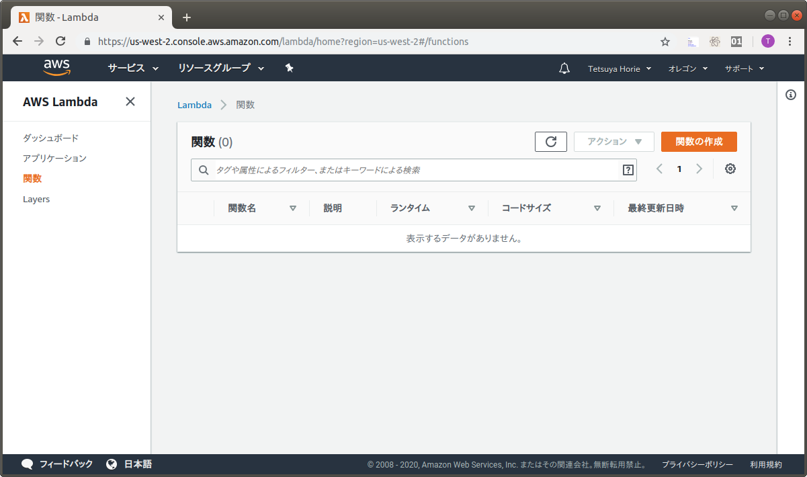
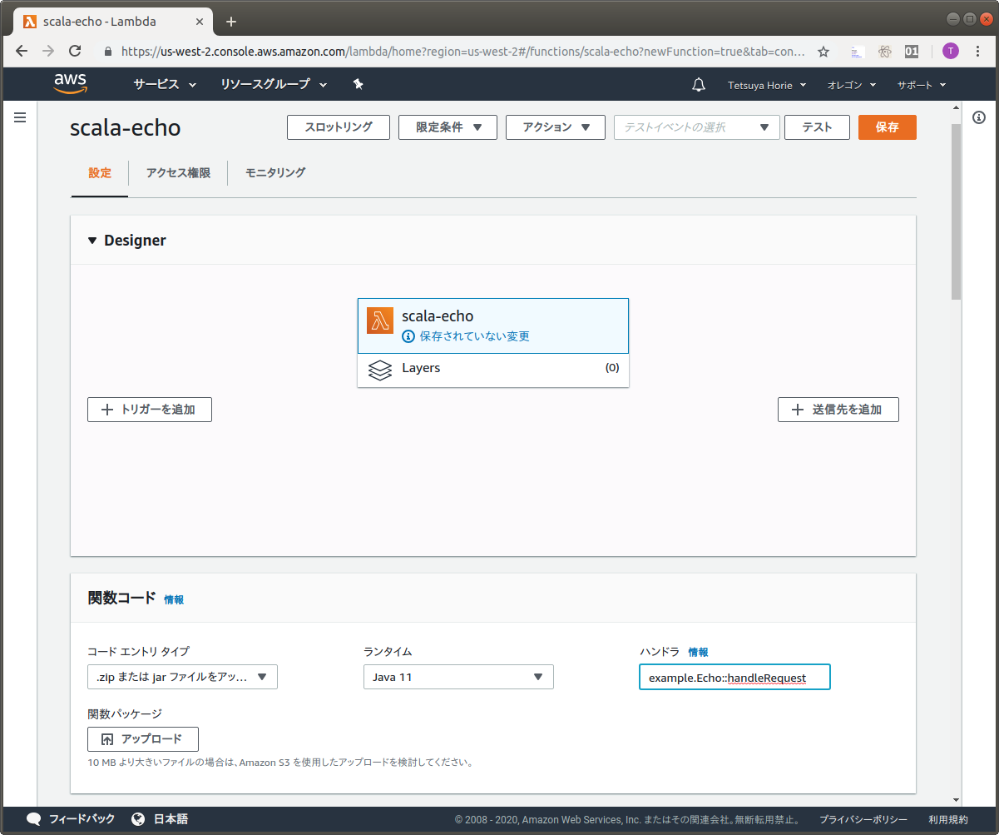
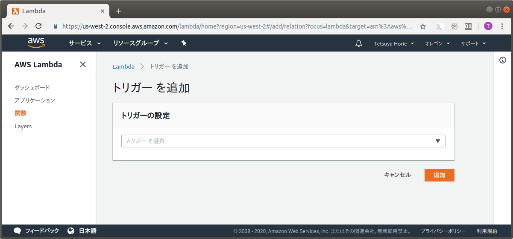
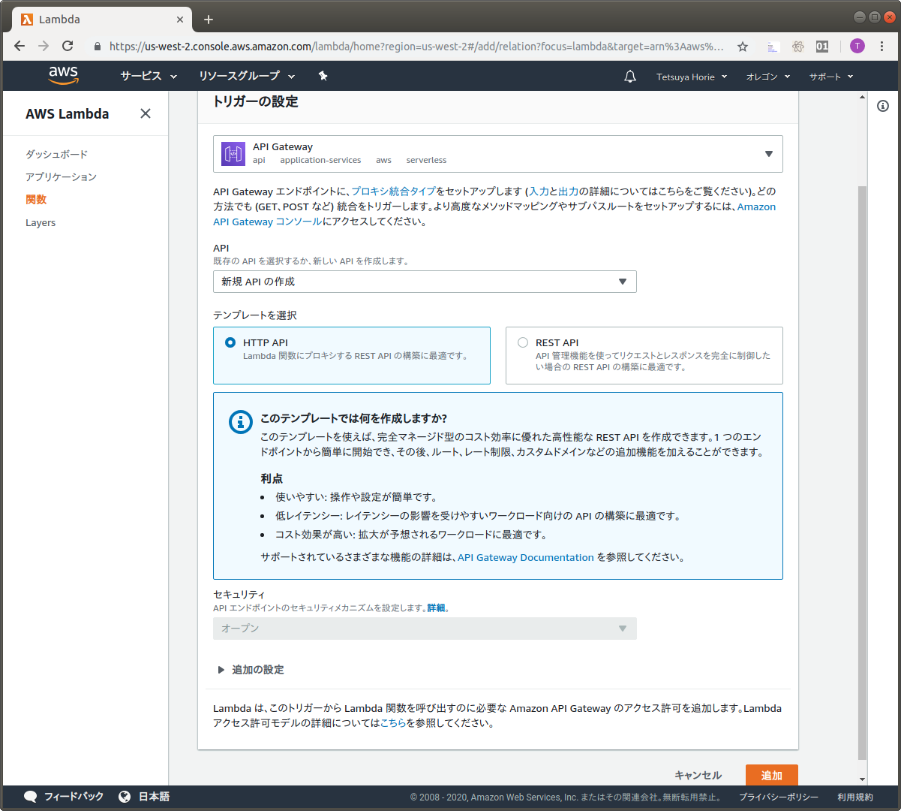
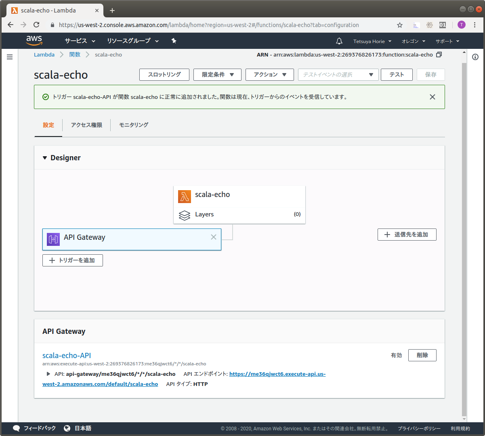

# ScalaでAWS Lambda

Scalaで書いた、AWS Lambdaを、API GatewayのHTTP APIで呼び出すサンプルコードです。

## jarファイルの作成

jarファイルを作成します。(jarファイルはtarget/scala-2.13/lambda_echo-assembly-0.1.0-SNAPSHOT.jarとして出力されます)

```bash
$ sbt assembly
```

## AWS Lambda関数の作成

AWS Lambdaのコンソール画面を表示します。



[関数の作成]ボタンをクリックします。


[関数名]に「scala-echo」と入力し、[ランタイム]は「Java 11」を選択し、[関数の作成]ボタンをクリックします。



[ハンドラ]を「example.Echo::handleRequest」に変更します。(Echoになっている事に注意)

[アップロード]バタンをクリックしてjarをアップロードして、[保存]ボタンをクリックします。

[トリガーを追加]ボタンをクリックします。



[トリガーを選択]で「API Gateway」を選択します。



[テンプレート]は「HTTP API」のままにして、[追加]ボタンをクリックします。



画面下部のAPIエンドポイントにPOST Requestを行います。

```bash
$ curl -X POST -d 'Hello, world!' https://me36qjwct6.execute-api.us-west-2.amazonaws.com/default/scala-echo
Hello, world!
```

注意: 上記URLは既に削除していますので、アクセスできません。
